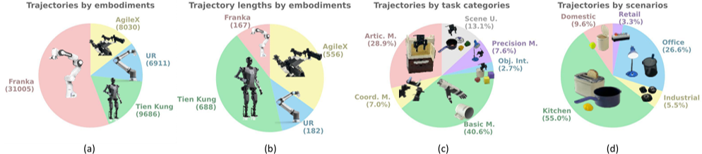
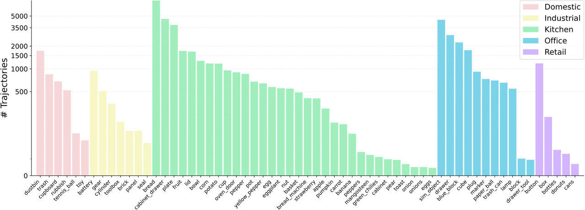

# [RoboMIND: Benchmark on Multi-embodiment Intelligence Normative Data for Robot Manipulation](https://x-humanoid-robomind.github.io/)

[](https://opensource.org/licenses/Apache-2.0)
[](https://x-humanoid-robomind.github.io/)
[](https://arxiv.org/abs/2412.13877)
[](https://zitd5je6f7j.feishu.cn/share/base/form/shrcnOF6Ww4BuRWWtxljfs0aQqh)
[](https://zitd5je6f7j.feishu.cn/share/base/form/shrcnOF6Ww4BuRWWtxljfs0aQqh)


## 📁 数据说明 📁
构建高质量的机器人训练数据集对开发具有良好泛化能力的端到端具身智能大模型至关重要。理想的数据集应涵盖多样化的场景、任务类型和机器人平台，使模型能够适应不同环境并可靠执行各类任务。本团队构建了一个大规模、真实的机器人学习数据集，记录机器人在复杂环境中执行长程任务时的交互数据，从而支持训练出具有通用操作能力的智能模型。

本数据集的部分目录结构示例如下，展示了Franka机器人下单个任务的2条训练轨迹和2条验证轨迹：
```
.
|-- h5_franka_1rgb
|   |-- bread_in_basket
|   |   `-- success_episodes
|   |       |-- train
|   |       |   |-- 1014_144236
|   |       |   |   `-- data
|   |       |   |       `-- trajectory.hdf5
|   |       |   |-- 1014_144602
|   |       |   |   `-- data
|   |       |   |       `-- trajectory.hdf5
|   |       |-- val
|   |       |   |-- 1014_144642
|   |       |   |   `-- data
|   |       |   |       `-- trajectory.hdf5
|   |       |   |-- 1014_151731
|   |       |   |   `-- data
|   |       |   |       `-- trajectory.hdf5
| -- h5_franka_3rgb
| -- h5_tiangong_1rg
| -- h5_ur_1rgb
| -- h5_songling_3rg
| -- h5_simulation
```

## 💾 数据分布 💾


### 🤖 机器人平台构成 🤖
RoboMIND数据集汇集了多种机器人平台的操作数据，包括19,222条Franka Emika Panda单臂机器人轨迹、9,686条"天工"人形机器人轨迹、8,030条AgileX Cobot Magic V2.0双臂机器人轨迹、6,911条UR-5e单臂机器人轨迹，以及11,783条在仿真环境中采集的Franka机械臂数据。其中，自研的"天工"人形机器人贡献了17.4%的数据量，提供了大量需要高度协调能力的双臂操作任务。

### 🔎 轨迹时长分布 🔎
从轨迹长度来看，不同机器人平台呈现出独特的分布特征。Franka和UR机器人的任务通常具有较短的轨迹，时间步数少于200步，这类数据特别适合用于训练基础操作技能。相比之下，"天工"和AgileX机器人的任务轨迹普遍较长，超过500个时间步，更适合用于训练长时间跨度的任务和复杂技能组合。

### 🚀 任务类型划分 🚀
基于自然语言描述，并考虑物品大小、使用场景和操作技能等因素，我们将数据集中的任务分为基础技能、精准操作、场景理解、柜体操作和协作任务五大类。除了基础操作任务外，数据集还包含了大量复杂任务，为训练通用机器人策略提供了丰富的数据支持。

### 💪 物品多样性 💪
整个数据集包含了61种不同的物品类别，具体如下所示。可以看出，在厨房场景中，数据集不仅包含了常见的食物，如草莓、鸡蛋、香蕉和梨子等，也包括了复杂的可调节物体，如烤箱和面包机。在家庭场景中，数据集既包括了刚性物体，如网球，也包括了可变形物体，如玩具。办公和工业场景则包含了需要精确控制的小物体，如电池和齿轮。这样多样化的物体种类不仅增加了数据集的复杂性，也有助于训练能够在各种环境下执行操作的通用操控策略。

// 

<div style="text-align: center; margin: 0 auto; width: 80%;">
  
</div>

## 📊 数据使用 📊

```
!pip install numpy
!pip install opencv-python
!pip install h5py
!pip install imageio
```

``` 
import numpy as np
import os
import cv2
import copy
import argparse
import imageio
import h5py
import cv2
from collections import defaultdict
from IPython.display import Image, display
import argparse
```

```
RESOLUTION = (128, 128)
```

```
class ReadH5Files():
    def __init__(self, robot_infor):
        self.camera_names = robot_infor['camera_names']
        self.camera_sensors = robot_infor['camera_sensors']
        self.arms = robot_infor['arms']
        self.robot_infor = robot_infor['controls']

    def decoder_image(self, camera_rgb_images, camera_depth_images):
        if type(camera_rgb_images[0]) is np.uint8:
            rgb = cv2.imdecode(camera_rgb_images, cv2.IMREAD_COLOR)
            if camera_depth_images is not None:
                depth_array = np.frombuffer(camera_depth_images, dtype=np.uint8)
                depth = cv2.imdecode(depth_array, cv2.IMREAD_UNCHANGED)
            else:
                depth = np.asarray([])
            return rgb, depth
        else:
            rgb_images = []
            depth_images = []
            for idx, camera_rgb_image in enumerate(camera_rgb_images):
                camera_rgb_image = np.array(camera_rgb_image)
                rgb = cv2.imdecode(camera_rgb_image, cv2.IMREAD_COLOR)
                if camera_depth_images is not None:
                    depth_array = np.frombuffer(camera_depth_images[idx], dtype=np.uint8)
                    depth = cv2.imdecode(depth_array, cv2.IMREAD_UNCHANGED)
                else:
                    depth = np.asarray([])
                rgb_images.append(rgb)
                depth_images.append(depth)
            rgb_images = np.asarray(rgb_images)
            depth_images = np.asarray(depth_images)
            return rgb_images, depth_images

    def execute(self, file_path, camera_frame=None, control_frame=None):
        with h5py.File(file_path, 'r') as f:
            is_sim = f.attrs['sim']
            is_compress = f.attrs['compress']
            is_compress = True
            image_dict = defaultdict(dict)
            for cam_name in self.camera_names:
                if is_compress:
                    if camera_frame is not None:
                        if len(self.camera_sensors) >= 2:
                            decode_rgb, decode_depth = self.decoder_image(
                                camera_rgb_images=f['observations'][self.camera_sensors[0]][cam_name][camera_frame],
                                    camera_depth_images=f['observations'][self.camera_sensors[1]][cam_name][camera_frame])
                        else:
                            decode_rgb, decode_depth = self.decoder_image(
                                camera_rgb_images=f['observations'][self.camera_sensors[0]][cam_name][camera_frame],
                                camera_depth_images=None)
                    else:
                        if len(self.camera_sensors) >= 2:
                            rgb_images = f['observations'][self.camera_sensors[0]][cam_name][:]
                            depth_images = f['observations'][self.camera_sensors[1]][cam_name][:]
                        else:
                            rgb_images = f['observations'][self.camera_sensors[0]][cam_name][:]
                            depth_images = None
                        decode_rgb, decode_depth = self.decoder_image(camera_rgb_images=rgb_images,camera_depth_images=depth_images)
                    
                    image_dict[self.camera_sensors[0]][cam_name] = decode_rgb
                    if len(self.camera_sensors) >= 2:
                        image_dict[self.camera_sensors[1]][cam_name] = decode_depth

                else:
                    if camera_frame:
                        image_dict[self.camera_sensors[0]][cam_name] = f[
                            'observations'][self.camera_sensors[0]][cam_name][camera_frame]
                        image_dict[self.camera_sensors[1]][cam_name] = f[
                            'observations'][self.camera_sensors[1]][cam_name][camera_frame]
                    else:
                        image_dict[self.camera_sensors[0]][cam_name] = f[
                           'observations'][self.camera_sensors[0]][cam_name][:]


            control_dict = defaultdict(dict)
            for arm_name in self.arms:
                for control in self.robot_infor:
                    if control_frame:
                        control_dict[arm_name][control] = f[arm_name][control][control_frame]
                    else:
                        control_dict[arm_name][control] = f[arm_name][control][:]
            base_dict = defaultdict(dict)
        return image_dict[self.camera_sensors[0]], control_dict, base_dict, is_sim, is_compress
```

```
def convert_dataset_image(robot_infor, resolution=RESOLUTION, dataset_dir="realworld_data", env_names=None, episode_num_pertask=5000):
    read_h5files = ReadH5Files(robot_infor)

    for env_name in env_names:
        # 创建保存图像的文件夹
        save_dir = f'saved_images/{env_name}'
        os.makedirs(save_dir, exist_ok=True)
        
        dataset_root = os.path.join(dataset_dir, env_name, 'success_episodes/train')
        cnt = 0
        for trajectory_id in sorted(os.listdir(dataset_root))[0:episode_num_pertask]:
            for file in os.listdir(os.path.join(dataset_root, trajectory_id, 'data')):
                if file.endswith('.hdf5'):
                    file_path = os.path.join(dataset_root, trajectory_id, 'data', file)
                    break
            print('executing ', cnt, 'th trajectory, file_path:', file_path)
            cnt += 1
            assert os.path.exists(file_path), f'{file_path} does not exist'
            image_dict, control_dict, base_dict, _, is_compress = read_h5files.execute(file_path)
            action_list = []
            for keys in control_dict.keys():
                control_list = []
                for control_key in control_dict[keys].keys():
                    control = control_dict[keys][control_key]
                    control_list.append(control)
                control = np.concatenate(control_list, axis=1)
                action_list.append(control)
            action = np.concatenate(action_list, axis=1)
            state = copy.deepcopy(action)
            
            action = action[1:]
            state = state[0:-1]
            for key in image_dict.keys():
                image_dict[key] = image_dict[key][0:-1]
            
            # Process images and create GIFs for each camera
            for cam_name in image_dict.keys():
                os.makedirs(os.path.join(save_dir, trajectory_id), exist_ok=True)
                gif_path = os.path.join(save_dir, trajectory_id, f'{cam_name}.gif')
                
                # Convert images to correct color format
                images = []
                for step in range(len(action)):
                    img = np.array(image_dict[cam_name][step])
                    # Convert BGR to RGB if necessary
                    if img.shape[-1] == 3:  # Check if image has 3 channels
                        img = cv2.cvtColor(img, cv2.COLOR_BGR2RGB)
                    img = cv2.resize(img, resolution, interpolation=cv2.INTER_AREA)
                    images.append(img)
                
                imageio.mimsave(gif_path, images, duration=0.1)  # 10 FPS
                print(f"Saved GIF to {gif_path}")
                # Display the GIF in the notebook
                display(Image(filename=gif_path))
            return 
```

```
def main(args):
    env_name = args.env_name
    if args.embodiments == "h5_ur_1rgb":
        robot_infor = { 
            "camera_names": ['camera_top'], 
            "camera_sensors": ['rgb_images'],
            "arms": ['puppet'],
            "controls": ['joint_position', 'end_effector'],
            "resolution": RESOLUTION
        }
        env_name = "bread_on_table" if args.env_name is None else args.env_name
    elif args.embodiments == "h5_franka_3rgb":
        robot_infor = {
            "camera_names": ['camera_top', 'camera_left', 'camera_right'],
            "camera_sensors": ['rgb_images'],
            "arms": ['puppet'],
            "controls": ['joint_position', 'end_effector'],
            "resolution": RESOLUTION
        }
        # env_name = "place_in_fruit"
        env_name = "2024_09_20_close_cabinet" if args.env_name is None else args.env_name
    elif args.embodiments == "h5_franka_1rgb":
        robot_infor = {
            "camera_names": ['camera_top'],
            "camera_sensors": ['rgb_images'],
            "arms": ['puppet'],
            "controls": ['joint_position', 'end_effector'],
            "resolution": RESOLUTION
        }
        trajectory_id = '1014_144358'
        env_name = "bread_on_table" if args.env_name is None else args.env_name
    elif args.embodiments == "h5_tienkung_1rgb":
        robot_infor = {
            "camera_names": ['camera_top'],
            "camera_sensors": ['rgb_images'],
            "arms": ['puppet','master'],
            "controls": ['joint_position', 'end_effector'],
            "resolution": RESOLUTION
        }
        env_name = "place_button" if args.env_name is None else args.env_name
    elif args.embodiments == "h5_agilex_3rgb":
        robot_infor = {
            "camera_names": ['camera_front', 'camera_left_wrist', 'camera_right_wrist'],
            "camera_sensors": ['rgb_images'],
            "arms": ['puppet', 'master'],
            "controls":  ['end_effector_left', 'end_effector_right', 'joint_effort_left', 'joint_effort_right', 'joint_position_left', 'joint_position_right', 'joint_velocity_left', 'joint_velocity_right'],
            "resolution": RESOLUTION
        }
        env_name = "35_putcarrot" if args.env_name is None else args.env_name
    elif args.embodiments == "h5_simulation":
        robot_infor = {
            "camera_names":  ['camera_front_external', 'camera_handeye', 'camera_left_external', 'camera_right_external'],
            "camera_sensors": ['rgb_images'],
            "arms": ['franka'],
            "controls": ['end_effector', 'joint_effort', 'joint_position', 'joint_velocity'],
            "resolution": RESOLUTION
        }
        env_name = "open_and_close_01" if args.env_name is None else args.env_name
    else:
        raise ValueError(f"Invalid embodiment: {args.embodiments}")
    dataset_dir = os.path.join(args.dataset_path, args.embodiments)
    convert_dataset_image(robot_infor, resolution=RESOLUTION, dataset_dir=dataset_dir, env_names=[env_name], episode_num_pertask=5)
```

```
if __name__ == "__main__":
    args = argparse.ArgumentParser()
    args.add_argument("--embodiments", type=str, 
                     choices=["h5_franka_1rgb", "h5_franka_3rgb", "h5_tienkung_1rgb", "h5_ur_1rgb", "h5_agilex_3rgb", "h5_simulation"],
                     default="h5_ur_1rgb",
                     help="Choose the embodiment for data processing")
    args.add_argument("--dataset_path", type=str, default="/media/data/benchmark1_0")
    args.add_argument("--env_name", type=str, default=None)
    args = args.parse_args([
    '--embodiments', 'h5_ur_1rgb',
    '--dataset_path', '/media/data/benchmark1_0',
    '--env_name', 'bread_on_table'
])
    main(args)
```


## 📝 Citation 📝
If you find RoboMIND useful in your research, please consider citing:
```
@article{wu2024robomindbenchmarkmultiembodimentintelligence,
        title={RoboMIND: Benchmark on Multi-embodiment Intelligence Normative Data for Robot Manipulation},
        author={Kun Wu and Chengkai Hou and Jiaming Liu and Zhengping Che and Xiaozhu Ju and Zhuqin Yang and Meng Li and Yinuo Zhao and Zhiyuan Xu and Guang Yang and Zhen Zhao and Guangyu Li and Zhao Jin and Lecheng Wang and Jilei Mao and Xinhua Wang and Shichao Fan and Ning Liu and Pei Ren and Qiang Zhang and Yaoxu Lyu and Mengzhen Liu and Jingyang He and Yulin Luo and Zeyu Gao and Chenxuan Li and Chenyang Gu and Yankai Fu and Di Wu and Xingyu Wang and Sixiang Chen and Zhenyu Wang and Pengju An and Siyuan Qian and Shanghang Zhang and Jian Tang},
        journal={arXiv preprint arXiv:2412.13877},
        year={2024}
      }
```


## 参与讨论
如果您对 RoboMIND 感兴趣，欢迎加入微信群，参与讨论。


